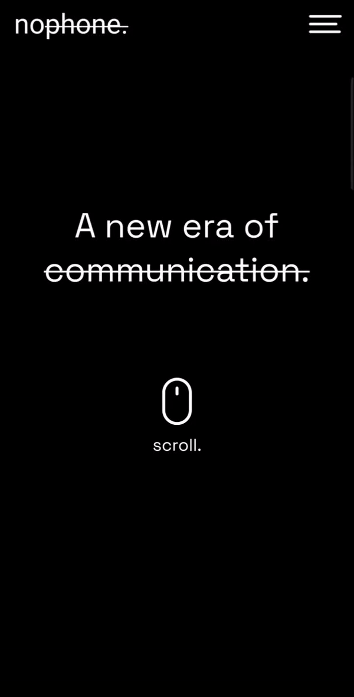

# Parallax Scroll

Simple app built with Flutter to showcase a parallax scrolling effect with blendmask and flutter_animate.

Try out the demo here
[Link to Demo](https://emmanueljoshua.github.io/parallax_scroll/)

Check out the Figma design [Link to UI](<https://www.figma.com/file/MyFQlFxiOWRAbyFVhJW3TZ/Parallax-Background-Scrolling-Animation-(Community)?node-id=27%3A14>)

## 💻 Requirements

- Any Operating System (ie. MacOS X, Linux, Windows)
- Any IDE with Flutter SDK installed (ie. IntelliJ, Android Studio, VSCode etc)
- Some knowledge of Dart and Flutter

## 🤓 Author(s)

**Joshua Emmanuel**

## 🔖 LICENCE

[Apache-2.0](https://github.com/JideGuru/flutter-tic-tac-toe/blob/master/LICENSE)
